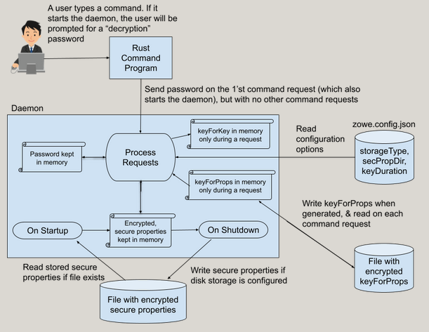

# Design for in-memory storage of secure Zowe CLI properties

# Overview
This document describes the design for storing secure CLI properties in memory as an alternative to using the Zowe Secure Credential Store.
# Use case
The current method of storing secure properties with the Zowe CLI is to use the Secure Credential Store (SCS). In Zowe V1, customers had to install an SCS plugin to acquire a method of secure storage. To ensure that the CLI could always initialize configurations with secure properties, the SCS was incorporated directly into the CLI. That choice also simplified the customer’s installation actions.

The SCS works reliably after being successfully installed. However, customers frequently encountered problems installing the SCS. Installation problems continue in our V2 release. They are now occurring during the installation of the CLI instead of during the installation of a plugin. Typically, the CLI installation completes and CLI commands will work. However, a CLI command that tries to access data in the SCS fails to load the SCS due to a previously failed SCS installation. The majority of the CLI commands connect to z/OS, which requires credentials. The credentials should be stored in the SCS. Thus, most CLI commands become unusable when the SCS fails to install.

The problems appear to stem from the 3rd party Keytar module that is used by the SCS. Some problems occurred when obtaining the Keytar binary module. Some problems occurred from overlooking the requirement to unlock the Linux keyring. The most recent set of problems seem to be due to a site’s highly secured environment. Broadcom staff cannot know or easily debug the security rules that a site uses to lock down its computer systems, since those rules apply to a 3rd party product whose internal implementation is not easily known or modified. Such a combination of problems delays a successful deployment of Zowe CLI, which frustrates customers.

The intent of storing secure properties in-memory is to provide an alternative for customers who encounter excessive difficulty installing the SCS; or for customers who never want secure credentials stored on disk (even if they are encrypted). The premise is that such customers could configure the CLI to use in-memory secure storage, which would by-pass the use of the SCS at that site. Broadcom software will be managing the security of the properties, not the 3rd party Keytar software. Keytar uses an O.S.-specific secure vault (like Credential Manager on Windows or a libsecret-based keyring on Linux). Those O.S. components would also be by-passed with a CLI in-memory storage mechanism, further reducing the number of additional components involved (and thus additional points of failure).

Another scenario for which an in-memory solution could provide value is the use of Zowe CLI on USS. Because no Keytar binary is available for USS, customers must store credentials in plain text. The proposed in-memory solution will use the Zowe CLI daemon, which also is not available for USS. However, creating a Zowe USS executable for use with the Zowe daemon will likely provide an easier path to implementation on USS than obtaining a USS version of Keytar.

The CLI will continue to provide the Secure Credential Store. It works well for many sites which do not encounter installation problems. Secure in-memory storage will simply be offered as an alternative for sites that decide to not use the SCS.

<b><u>Secure properties in memory not applicable to VS Code extensions</u></b>

Applications like Zowe Explorer, which are extensions to Visual Studio Code, utilize a version of Keytar automatically supplied by VS Code. The bundling of Keytar in VS Code has not resulted in installation difficulties for users of applications like Zowe Explorer. These applications are successfully managing credentials without the need for an independent in-memory property store from the CLI.

Further, an objective of Zowe Explorer (and its own set of extensions) is to remain independent of an installation of Zowe CLI. While these VS Code extensions make use of Zowe CLI SDK APIs, they do not want to require their users to install a copy of Zowe CLI on their laptops. To run the Zowe CLI daemon (even behind the scenes) a copy of Zowe CLI would have to be installed.

# Technical approach

Normally, CLI commands start a process that performs one operation and then exits. Credentials cannot be stored in memory, because the memory is lost when the command process exits. When a site enables daemon mode, the CLI starts a long-running process (the daemon). The daemon can hold credentials in memory which can be used for many different CLI commands run by a user. Therefore, our approach for storing secure properties in memory will require a customer to run in daemon mode.

Storing secure properties in memory will be an optional feature of the daemon, since some users may want only the performance improvements of the daemon. A new configuration property named securePropStorage.storageType&nbsp;will be available within the zowe configuration (zowe.config.json). When that property is set appropriately, the daemon will obtain secure properties from an in-memory collection of secure properties. Thus, the daemon will not attempt to load the Secure Credential Store. 

<b><u>Populating secure property values</u></b>

When the daemon is started, it has no secure properties. They must be obtained from the user. Existing CLI logic will interactively prompt a user for missing “connection” properties, like host, port, user name, password, and a few other others. In the Zowe V2 release, the CLI expanded the concept that a user could store credentials securely to instead allow the user to define any property as secure. Any property that the user specifies as secure will be stored securely.

If the daemon retains the limitation to prompt for only a select set of “connection” properties, then users could still have other properties defined as secure which could only be stored and retrieved from the Secure Credential Store. Such a user would not be able to eliminate the use of the SCS, which was the very intent of the in-memory feature. To properly achieve a functional in-memory secure property cache, the CLI must expand the set of properties for which it will prompt to include any property that is defined by the user as secure.

The daemon will not&nbsp;prompt for every secure property upon startup. Rather, the daemon will prompt for a given secure property as it is needed by a given CLI command. For example, assume that a user's zosmf password is a secure property, and the user's TSO account number is a secure property. If a user enters a command to list datasets, the user will only be prompted for his/her zosmf password. Only later, when the user enters a TSO command will the user be prompted for a TSO account number. 

When the CLI prompts for a secure property value, it will use that value in the desired command, and it will also store that value into an in-memory structure of secure properties. On future commands, the CLI will look for a required secure property in memory and will only prompt the user if the property is not found in memory.

<b><u>Updating secure property values</u></b>

A user is prompted for a property value only once, after which that value remains in memory for future use. We must accommodate the situation in which the property value must be changed. For example, the user may have been required to change his/her password.

It seems feasible that the zowe config set&nbsp;and the zowe config secure commands &nbsp;could be modified to detect that we are running with secure properties in-memory and update a secure property in memory instead of storing that value in the Secure Credential Store.

Alternative: If there are unforeseen technical difficulties with the zowe config set (and secure)&nbsp;approach, a backup approach could be to instruct the user to run the &nbsp;zowe config restart&nbsp;command. The user would experience the same behavior as if (s)he were starting up the daemon for the day. The user could be prompted for secure properties as they are needed by various commands.

<b><u>Retaining secure properties on disk</u></b>

The need to prompt the user for each needed secure property to re-populate the in-memory cache of secure properties each time that the daemon is started would be a drawback of this feature compared to the Secure Credential Store, which permanently remembers secure property values once they are set.

We anticipate that a common practice will be to start the daemon once a day. Thus, every day the user will be prompted again for secure properties. Depending on the user’s configuration, each day the user may be prompted for a few properties to possibly dozens of properties. Again depending on usage, those prompts may occur very early on, or may be spread out over the course of the day.

To avoid the inconvenience of having to enter all secure properties every day, we will create a user-selectable option to have the daemon store its encrypted credentials to disk when the daemon shuts down. The configuration property named securePropStorage.storageType&nbsp;can be configured with one of two values: daemonMemOnly &nbsp;or daemonMemAndDisk.

The daemonMemOnly value directs the daemon to only keep secure properties in memory. It will not use the SCS and it will not store its own secure properties to disk. This option might be chosen by ultra-secure companies that do not want secure properties ever stored to disk, even if those properties are encrypted.

The daemonMemAndDisk&nbsp;value directs the daemon to keep secure properties in memory and store them to disk. Again, this option will not use the SCS. When the daemon shuts down, encrypted properties that have been stored in memory will be written to disk.

When the secure properties have been stored to disk, the daemon can reload those properties the next time the daemon is started. By doing that, the user will not have to interactively enter property values that (s)he previously entered.

# Security considerations

When using the daemonMemAndDisk&nbsp;option, both a disk file containing the encrypted properties and a disk file containing the secret key to decrypt those properties will be stored in the $ZOWE_CLI_HOME/daemon directory. That directory is owned by the end-user. Thus, the security access for those files can be restricted by the user.&nbsp;We will create these files as readable and writable by only the user. Such an approach will work for Linux and Mac. On Windows, NodeJs APIs may not perform any such permission modification in the Windows NTFS filesystem. We will investigate the possibilities, but it is likely that we will not have the same permission control on Windows.

Storing both the secret key and the encrypted properties on disk will be a security vulnerability. A customer can set another configuration property, named securePropStorage.daemonPropDir, to a directory in which to store both the encrypted properties file and secret encryption key file.&nbsp;That directory could be on a thumb drive or some other secure device used by the company. Some ultra-secure sites may use such practices to avoid ever storing sensitive data on the internal disk of a computer. Some security literature suggests that some sites require users to bring the secure data with them on a removable device and take the removable device with them when they leave the computer.

Most Zowe customers are very security conscious, but do not go to the extreme of requiring users to carry secure removable devices. Most Zowe customers will likely want to store in-memory data to the computer’s disk, but to do so with reasonable security. The secret key file will reside right next to the disk file of encrypted secure properties. We must prevent the secret key file from being able to decrypt the encrypted properties. Otherwise, if an attacker gained access to the files, both files could be stolen and the encrypted properties could be easily decrypted off-site.

To prevent such a vulnerability, Zowe CLI will also encrypt the secret key file. When Zowe CLI is configured to store credentials in memory, it will ask the user for a “decryption” password whenever it starts the Zowe daemon. This password will only be used for encryption and decryption on the client system. It is not a mainframe password, and will never be passed to the mainframe. This “decryption” password will be used to generate a second secret key, which we will call keyForKey. KeyForKey will only exist in memory during a daemon request. KeyForKey will never be stored on disk. KeyForKey will be regenerated during each daemon request. KeyForKey will decrypt the primary secret key, which we will call keyForProps. KeyForProps will, in turn, decrypt the secure properties. As a result, if an attacker steals both the keyForProps file and the encrypted properties file, the attacker will not be able to use the keyForProps file to decrypt the actual properties file, because the keyForProps file is also encrypted.

Simply storing properties in memory is also not secure. The property values stored in memory must be securely encrypted. A given value must be decrypted when used as part of a user request. In a garbage-collection type of language, like JavaScript, you cannot directly, immediately remove that decrypted value from memory. You are at the mercy of the garbage collector for the timing of the removal from memory. Our app can use techniques like setting the decrypted variable to null after its use, ensuring that the variable goes out of scope after its use, and maybe a few other techniques. Those techniques only guarantee that the variable becomes a candidate for removal. The techniques do not control when that removal will occur.

We expect that a common practice will be to run the daemon for a full day, before shutting down at the end of the work day. However, a customer could leave the daemon running for a much longer period of time. It is reasonable to assume that garbage collection will occur sooner than the indefinite operation of the daemon. Also, the daemon might hold a dozen encrypted variables indefinitely, and a set of user commands might only require one or two decrypted variables. Only those one or two decrypted variables have to wait for garbage collection. The rest all remain securely encrypted. For these reasons, we plan to use the following techniques to encrypt the properties that are stored in daemon memory indefinitely.[[a]](#cmnt1)

Before storing a secure property value in memory, our daemon will use the user-supplied password to generate the keyforKey. The daemon will read the encrypted keyForProps file from disk and decrypt the contents of that file. Finally, it will use the decrypted&nbsp;keyForProps to encrypt a property that is to be stored in memory using AES 256 encryption. 

Decryption of secure properties can only be performed if all three of the following items are available:

1. The encrypted properties
1. The encrypted keyForProps
1. The user-supplied password

These three items will only exist in memory for the duration of a daemon request. Only the user-supplied password and the encrypted properties remain in memory constantly, and the password cannot be used to directly decrypt the encrypted properties.

When running in daemon mode, a Zowe Rust-language executable becomes the user’s actual command line program. The Rust program starts a daemon when one is needed and the Rust program will provide the user-supplied password to the daemon when it starts the daemon. The Rust program then sends every user command as a request to the daemon through a local network communication channel (domain sockets or named pipes).

When the daemon starts, it receives the user-supplied password, which it will keep in memory indefinitely. When the daemon starts, it will also read the encrypted properties file if it exists. The daemon will keep encrypted properties in memory indefinitely. When the daemon receives a request, it will read the encrypted keyForProps file if it exists, or it will generate keyForProps and save an encrypted version of keyForProps to disk. Thus during a request, the daemon has the three items necessary for encryption and decryption. After the request is complete, the daemon will clear the variables that contain keyForKey and keyForProps.

To compromise this approach, an attacker would have to gain access to the computer memory of the running daemon, find the locations of the password, the keyForProps, and the encrypted properties. And, the attacker must do this during the time that the daemon is processing a request. This seems like a reasonably small attack surface. We feel it is much harder for an attacker to investigate memory during a short time period, than it would be to steal disk files and process them off-site. 

Of course, program memory can be paged to disk. We believe that the OS kernels restrict access to the page file, making it harder for a normal user to access that file. Also, the three required pieces of data are only in memory during the time that the daemon is processing a request. Thus, the OS is unlikely to page the daemon to disk with those three data items because the daemon is active at that time processing the request, and an active program would not be a good candidate for paging.

The daemon will generate keyForProps by using 256 bits of output from a cryptographically strong pseudorandom data function.

The daemon will generate keyForKey from the user-supplied password using a Password-Based Key Derivation Function from a cryptographic library.

<b><u>Periodic key change</u></b>

A good security practice is to periodically change a secret key that is used for encryption. When the key is changed, the daemon must decrypt any secure properties in memory with the old key and then encrypt the properties again with a new key. Another new configuration property named securePropStorage.daemonKeyDuration&nbsp;can be set by customers to adjust how often the key should be changed. Because re-encryption will slow performance, the default value will be once per week and&nbsp;the minimum value that the CLI will accept is 1 hour.

<b><u>Password change</u></b>

The user will be prompted for a password whenever the daemon starts. The user must supply that same password every time (s)he is prompted. The user may want the ability to change that password. 

We feel that the creation of a new zowe command would be the best approach - something like zowe config reset-daemon-password. Such a command would:

- Decrypt the keyForProps file using the old password and old salt
- Generate a new salt
- Generate a new keyForKey using the new password, and a new salt
- Re-encrypt the keyForProps using the new keyForKey
- Store the newly re-encrypted keyForProps to disk

Because the scope of this design is already significant, we do not plan to provide such a new command at this time. Also, an in-the-field workaround will exist. A user could delete the keyForProps.json and storedProps.json files. While the user will be prompted for every secure value again, the user could supply a new password at that time. This will also be the required technique if the user forgets his/her password.

<b><u>Conversion of properties between SCS and in-memory storage</u></b>

It might be technically feasible to import SCS secured properties into the in-memory scheme and the reverse. However, such features are beyond the scope of this proposal. We do not plan to implement any such feature at this time or support the simultaneous use of both SCS and in-memory secure properties. A user (more likely a site) will decide which mechanism to use and only interact with that one mechanism. A user could turn in-memory storage on and off, which would revert back to the SCS. However, changes to secure properties made with one mechanism will not be available when the other mechanism is used.

<b><u>Performance</u></b>

Encryption and decryption are CPU-intensive operations which can impact performance. It is not clear how much the use of in-memory secured properties will affect performance, which is a key selling point of running Zowe CLI in daemon mode. It should be noted that the SCS must also perform encryption and decryption, so theoretically the performance could be similar to what we observe today with SCS. We will not be able to assess any performance impact until the new features are implemented.
# In-memory secure properties in CI/CD pipelines

The recommended approach for using secure data with Zowe CLI in a CI/CD pipeline is to keep all such secure data items in the secure data tool of the pipeline. For example, in Jenkins, such secure data would be stored in the “Jenkins Secrets” tool. The pipelines’ secure tools are generally much easier to set up than either SCS or in-memory secure properties inside of a CI/CD pipeline.

A DevOps engineer could store every secure property in a Jenkins Secret. Inside the pipeline, a Jenkins Secret’s value could be placed into a Zowe_OPT_XXX type of environment variable. That value will be used in any following Zowe commands as the value of the corresponding XXX command line property. For example, the value of the variable named ZOWE_OPT_PASSWORD, would be used as the password for any Zowe commands.

The remainder of this section describes techniques that could be applied to use in-memory secure properties in a CI/CD pipeline and helps the reader gauge the complexity of such an effort.

Since the daemon originally populates its in-memory secure properties by interactively prompting the user, the daemonMemOnly &nbsp;option would not be viable in a CI/CD pipeline. You would not want many Zowe commands prompting for many secure properties in a pipeline. However, by using the daemonMemAndDisk&nbsp;option and some technique, a DevOps engineer could deploy the daemon with secure credentials in a CI/CD pipeline.

Outside of a pipeline, the DevOps engineer would run a set of Zowe commands (using the daemonMemAndDisk mode) which will prompt for a password and for all of the desired secure properties. The DevOps engineer would then stop the daemon, which would store the secure properties to disk. The DevOps engineer would commit the encrypted properties file and the encrypted keyForProps file into the source control system used by the site.

To supply the same password inside the pipeline when prompted by Zowe for a password, the user would place the password into the secure data tool of the pipeline (like &nbsp;the “Jenkins Secrets” tool). The DevOps engineer would then use that password in a Linux ‘expect’ command ([https://man7.org/linux/man-pages/man1/expect.1.html](https://www.google.com/url?q=https://man7.org/linux/man-pages/man1/expect.1.html&sa=D&source=editors&ust=1667332042709385&usg=AOvVaw1dTB2LosRc-fM2PfhO9L8f)) to simulate an end user interactively supplying a password to the first Zowe command. 

When the pipeline is run, user-written pipeline scripts would copy the secure properties file and the keyForProps file from source control into the $ZOWE_CLI_HOME/daemon directory. 

A pipeline script would enable the daemon. The pipeline script would start the daemon by running a simple Zowe command. The daemon would read the encrypted secure properties file into memory, just as it would outside of a pipeline.

Pipeline scripts would run the desired zowe commands. The daemon will use the password and the keyForProps to decrypt secure properties as needed. Again this behavior would be the same as outside of a pipeline.

By setting up the appropriate options, and making Zowe CLI generate both the encrypted properties file and keyForProps file in advance, the pipeline can run Zowe commands with in-memory secure properties without the need to prompt for any of the secure properties.

If any of the secure property values change, or if the site changes the password, the initial setup steps would have to be performed again before running the pipeline.

# Detailed design
This section provides enough details about how the storage of secure properties in memory would work to allow the reader to judge the feasibility of the design.

<b><u>Component interactions</u></b>

Earlier sections described how individual actions would behave. The following diagram displays how secure data is stored and retrieved.

- The daemon performs all cryptographic operations.
- The Rust program only prompts for a password and sends it to the daemon.

<b><u>In-memory configuration options within zowe.config.json</u></b>

A new object within zowe.config.json will contain the following properties.

securePropStorage {

&nbsp; &nbsp; storageType: daemonMemOnly | daemonMemAndDisk

&nbsp; &nbsp; daemonPropDir: &nbsp; &nbsp; &nbsp; &nbsp;// path to the directory to hold secure files

&nbsp; &nbsp; daemonKeyDuration: // 1 week will be the default

}

If the securePropStorage configuration object is not specified, any properties within “secure” arrays in the zowe.config.json file will be managed by our traditional Secure Credential Manager.

Zowe CLI has a mechanism to override the Secure Credential Manager with a 3rd party credential manager. The current plan is to leave that feature as it is. We do not plan to move such overrides from $ZOWE/CLI_HOME/settings/imperative.json&nbsp;into the new securePropStorage team config object at this time.

Any changes to zowe.config.json and imperative.json must implement our desired behavior without introducing a breaking change. This is likely the only area of this design with the potential for breaking changes. Therefore we must focus on avoiding breaking changes in this area of modification.

<b><u>Data structure to hold the key for decrypting secure properties</u></b>

$ZOWE_CLI_HOME\daemon\keyForProps.json

&nbsp; &nbsp; {

&nbsp; &nbsp; &nbsp; &nbsp; encKeyForProps : &nbsp;// encrypted &amp; base64 encoded key to decrypt properties

&nbsp; &nbsp; &nbsp; &nbsp; saltForPassword : &nbsp;// salt for generating keyForKey from the user password

&nbsp; &nbsp; &nbsp; &nbsp; lastKeyGenTime : &nbsp;// the time that a keyForProps was last generated

&nbsp; &nbsp; }

<b><u>Data structure to store secure properties on disk</u></b>

This object must be structured similarly to the in-memory representation of our team configuration. Doing so will enable our code to most easily find the encrypted value of a desired secure property. This object would only have to contain the secure properties. No other properties will be required in this object. Using the zowe.config.json structure for illustrative purposes, the content of our in-memory credentials might be similar to the following.

$ZOWE_CLI_HOME\daemon\storedProps.json

&nbsp; &nbsp; "profiles": {

&nbsp; &nbsp; &nbsp; &nbsp; "my_zosmf_profile": {

&nbsp; &nbsp; &nbsp; &nbsp; &nbsp; &nbsp; "secure": [

&nbsp; &nbsp; &nbsp; &nbsp; &nbsp; &nbsp; &nbsp; &nbsp; "user": &nbsp; &nbsp; &nbsp; &nbsp;// AES 256 encrypted, base64 encoded user value,

&nbsp; &nbsp; &nbsp; &nbsp; &nbsp; &nbsp; &nbsp; &nbsp; "password": // AES 256 encrypted, base64 encoded password value

&nbsp; &nbsp; &nbsp; &nbsp; &nbsp; &nbsp; ]

&nbsp; &nbsp; &nbsp; &nbsp; },

&nbsp; &nbsp; &nbsp; &nbsp; "my_endevor_profile": {

&nbsp; &nbsp; &nbsp; &nbsp; &nbsp; &nbsp; "secure": [

&nbsp; &nbsp; &nbsp; &nbsp; &nbsp; &nbsp; &nbsp; &nbsp; "user": &nbsp; &nbsp; &nbsp; &nbsp;// AES 256 encrypted, base64 encoded user value,

&nbsp; &nbsp; &nbsp; &nbsp; &nbsp; &nbsp; &nbsp; &nbsp; "password": // AES 256 encrypted, base64 encoded password value

&nbsp; &nbsp; &nbsp; &nbsp; &nbsp; &nbsp; ]

&nbsp; &nbsp; &nbsp; &nbsp; },

&nbsp; &nbsp; &nbsp; &nbsp; …

&nbsp; &nbsp; }

Open Question: When stored in memory, should we keep a separate structure similar to the one for disk storage above, or can we find a way to simply embed an encrypted secure property into our existing in-memory representation of our team configuration? This will be resolved during the implementation of this feature.

Open Question: What happens when zowe.config.json is changed in between when the secure properties are saved to disk and when those properties are reloaded from disk?

- Maybe when the modification date of zowe.config.json is newer than storedProps.json we do NOT&nbsp;load storedProps.json?

# Pseudo code

Each of the following sections of pseudo code are provided to demonstrate that a reasonable approach exists to accomplish the desired operations using the proposed data and CLI components. The eventual implementation does not have to follow these exact algorithms. This pseudo code is only provided to identify a starting point and to ensure that no major decisions are overlooked in the final implementation.

<b><u>Rust pseudo code</u></b>

- <u>On daemon start</u>: When the CLI Rust program determines that it must start a daemon, the Rust program must send a user-supplied password to the daemon that it starts.

    - Prompt the user for a password.
    - Place the password value into a new “userPassword” property of the JSON object used to send command requests to the daemon.
    - Send the command request to the daemon, as it has always done.

- <u>On each new command</u>: The Rust program takes the same actions as always. It will not have to take any new actions to support secure properties in memory.

<b><u>Daemon pseudo code</u></b>

- <u>On startup</u>: The daemon will load secure properties from disk into memory if that option has been configured.

    - if securePropStorage.storageType == daemonMemAndDisk &amp;&amp; storedProps.json exist
        - Copy the user’s password from the request for this command into a variable that will remain in memory
        - read storedProps.json into inMemProps
        - delete storedProps.json

- <u>On each command request</u>: The daemon will decrypt any needed property that is stored in memory. It will prompt for any needed property that is not stored in memory. It will re-encrypt secure properties after a specified period of time.

    - If zowe.config.json{securePropStorage.storageType} == daemonMemAndDisk
        - Read encrypted keyForProps.json file  
        - // Is it time to re-encrypt the secure properties?
        - if inMemProps exist &&  
            CurrentTime - keyForProps.json{lastKeyGenTime} >  
            zowe.config.json{securePropStorage.daemonKeyDuration}
            - // Decrypt the current secure properties in memory
            - Use a Password-Based Key Derivation Function (scrypt) to generate the keyForKey from the password and keyForProps.json{saltForPassword}
            - Use keyForKey to decrypt keyForProps.json{encKeyForProps} into keyForProps
            - Use keyForProps to decrypt inMemProps into inMemPropsPlain   
            - // Re-encrypt the properties with a new keyForProps
            - Generate a newKeyForProps from random data
            - Use newKeyForProps to re-encrypt the inMemPropsPlain using back into inMemProps
            - Store the newly re-encrypted inMemProps into storedProps.json on disk   
            - // Generate new salt and new keyForKey from password
            - Use crypto.randomBytes() to create a newSalt from 32 bytes of random data
            - Use scrypt() to generate a newKeyForKey from the password and newSalt   
            - // Encrypt the new keyForProps before storing it to disk
            - Use newKeyForKey to encrypt newKeyForProps
            - Store the encrypted newKeyForProps, the newSalt, and the current time into keyForProps.json{encKeyForProps, saltForPassword, lastKeyGenTime}   
        - if request needs a desiredSecureProp
            - // Decrypt the keyForProps
            - Use scrypt() to generate the keyForKey from the password and keyForProps.json{saltForPassword}
            - Use keyForKey to decrypt keyForProps.json{encKeyForProps} into keyForProps   
            - if inMemProps contains desiredSecureProp
                - Use keyForProps to decrypt inMemProps into inMemPropsPlain
                - Retrieve desiredSecureProp from inMemPropsPlain
            - else
                - Prompt for desiredSecureProp
                - Use keyForProps to encrypt desiredSecureProp into inMemProps
    - Perform the request using desiredSecureProp  

- <u>On shutdown or on-process-end</u>: The daemon will write secure properties to disk if that option has been configured.

    There is a "shutdown" operation, which the "daemon restart" uses. The more common situation will be when a user closes the terminal window or reboots the machine. The "process" module has some event handling options, like:

        process.on('SIGTERM', () => { Do-whatever }

    The plan is to rely on such “on” conditions to catch such shutdown events.

    - if inMemProps exist && securePropStorage.storageType == daemonMemAndDisk
        - write storedProps.json

<b><u>Zowe config set and zowe config secure pseudo code</u></b>

The following logic will exist in the 'zowe config set' and 'zowe config secure' commands to determine if a secure property should be stored in memory or stored in the Secure Credential Store.

- if the property is secure
    - if securePropStorage.storageType == daemonMemOnly || securePropStorage.storageType == daemonMemAndDisk
        - Use the same techniques as above to encrypt desiredSecureProp into inMemProps
    - else
        - store in SCS

# Findings on available crypto libraries

<b><u>Javascript crypto libraries</u></b>

Our NodeJS Javascript daemon must perform secure encryption. Numerous Javascript packages exist which provide encryption capabilities. Little objective information exists on what differentiates one package from another. We investigated overview information for the following packages.

- crypto-js
    - JavaScript library of crypto standards.
    - [https://www.npmjs.com/package/crypto-js](https://www.google.com/url?q=https://www.npmjs.com/package/crypto-js&sa=D&source=editors&ust=1667332042721372&usg=AOvVaw2M81DqaAZB29xdmdVyhIUZ)
    - 4,652,740 weekly downloads
    - MIT License
- CryptoJs
    - JavaScript implementations of standard and secure cryptographic algorithms. CryptoJS is a project that I enjoy and work on in my spare time, but unfortunately my 9-to-5 hasn't left me with as much free time as it used to. I'd still like to continue improving it in the future, but I can't say when that will be. If you find that CryptoJS doesn't meet your needs, then I'd recommend you try Forge.
    - [https://cryptojs.gitbook.io/docs/](https://www.google.com/url?q=https://cryptojs.gitbook.io/docs/&sa=D&source=editors&ust=1667332042721980&usg=AOvVaw3v3OdPYqLNj9Tqdlvc__4V)
    - ? weekly downloads<
    - New BSD License
- node-forge
    - A native implementation of TLS (and various other cryptographic tools) in JavaScript.
    - [https://www.npmjs.com/package/node-forge](https://www.google.com/url?q=https://www.npmjs.com/package/node-forge&sa=D&source=editors&ust=1667332042722816&usg=AOvVaw3rr5oz9hIJa75gJtiRwhgs)
    - 17,226,352 weekly downloads<
    - You may use the Forge project under the terms of either the BSD License or the GNU General Public License (GPL) Version 2.
- Node.js Crypto
    - The node:crypto module provides cryptographic functionality that includes a set of wrappers for OpenSSL's hash, HMAC, cipher, decipher, sign, and verify functions.
    - [https://nodejs.org/api/crypto.html#crypto_crypto](https://www.google.com/url?q=https://nodejs.org/api/crypto.html%23crypto_crypto&sa=D&source=editors&ust=1667332042723297&usg=AOvVaw1t0lRGwhJH9Crkl23s_HEq)
    - 3,698,340 downloads of the full Node.js package on Aug 4, 2022
    - MIT License

    <b><b>

    <b><u>Selected package</u></b>

    The Javascript crypto library that we plan to use is Node.js Crypto for the following reasons:

    - Zowe CLI already relies on Node.js. We add no new dependency.
    - Significantly more tutorial documentation exists for this package than any of the others.
    - Node.js Crypto provides all necessary functionality.
    - No comparative information exists to recommend another package over Node.js Crypto.

    <b><b>

    The Node.JS Crypto documentation states that “It is possible for Node.js to be built without including support for the node:crypto module.” Because that statement is a cause for uncertainty, we wrote an experiment to perform the following actions with Node.JS Crypto:

    - Wrote the experiment on a Windows laptop.
    - Used the Node.JS Crypto module to encrypt and decrypt some hard-coded text within an existing Zowe CLI command handler.
    - Used AES encryption with a hard-coded 256 bit key.
    - The data encryption and decryption worked successfully.

    <b><b>

    Our interpretation of the Node.js Crypto disclaimer is that you may not have the crypto library if you compile nodeJS yourself. We assume that if you download a standard LTS version of Node.js, it will contain a working crypto module.

<b><u>Rust hash libraries</u></b>

In an earlier design iteration, we intended to use a cryptographic hash function in the Rust program. After some design changes, we no longer need any cryptographic functions in the Rust program. We have chosen to retain the following information as a record of our analysis of Rust hashing options.

Numerous Rust crates exist which provide encryption capabilities. Our Rust command line program must only create a secure hash. We focused on crates that only provide hash functions to avoid including extra unnecessary functionality. We investigated overview information for the following crates.

- crypto-hash
    - A Rust wrapper around OS-level implementations of cryptographic hash functions.

        By operating system:
        - Windows: CryptoAPI
        - OS X: CommonCrypto
        - Linux/BSD/etc.: OpenSSL
    - [https://crates.io/crates/crypto-hash](https://www.google.com/url?q=https://crates.io/crates/crypto-hash&sa=D&source=editors&ust=1667332042725922&usg=AOvVaw2U54xdIcryH4x7e5mOUPPz)
    - 3,500 downloads on Aug 1, 2022
- seahash
    - A blazingly fast, portable hash function with proven statistical guarantees.

        A word of warning!
        This is not a cryptographic function, and it certainly should not be used as one. 
    - [https://docs.rs/seahash/latest/seahash/](https://www.google.com/url?q=https://docs.rs/seahash/latest/seahash/&sa=D&source=editors&ust=1667332042726581&usg=AOvVaw1NWLllBK56a5_wQKp7ixkV)
    - 13,882 downloads on Aug 1, 2022<
    - MIT

- RustCrypto/hashes
    - Collection of cryptographic hash functions written in pure Rust.
    - [https://github.com/RustCrypto/hashes](https://www.google.com/url?q=https://github.com/RustCrypto/hashes&sa=D&source=editors&ust=1667332042727098&usg=AOvVaw3Fb50mr1z_DYMc2zAIBb02)
    - 30,000 downloads on Aug 1, 2022
    - MIT OR Apache-2.0 License

    <b><u>Selected crate</u></b>

    The Rust hash crate that we plan to use is RustCrypto/hashes for the following reasons:
    - It is a true cryptographic hash.
    - Because it is self-contained (pure Rust), it will not be reliant on the different APIs available on different operating systems.
    - It documents support for the SHA3-256 hash
        - SHA3-256 is the newest SHA hash algorithm, documented in NIST standard FIPS pub 202.
        - SHA3-256 is also one of the hash functions included in the latest Federal Information Processing Standards Publication (FIPS) 140-3. Adherence to this standard is often required for U.S. Federal Government contracts.

    We wrote an experiment to perform the following actions with RustCrypto/hashes:
    - Wrote the experiment on a Windows laptop.
    - Within an existing Rust command, we used the RustCrypto/hashes crate to create a SHA3 256 bit hash from some hard-coded input.
    - This hash should be the right size for a key to be used in the AES 256 encryption that will be done in the daemon.
    - The hash generation worked successfully.

# Proposed user documentation

To be supplied after implementation as a starting point for our Technical Writers.

[[a]](#cmnt_ref1)During review, it was pointed out that since encrypted data must be unencrypted to perform a user's operation, that unencrypted data will remain in memory when using a garbage-collection type of language like JavaScript. This is a true statement. I added a justification to this document for why we still encrypt properties when keeping them in memory indefinitely.

