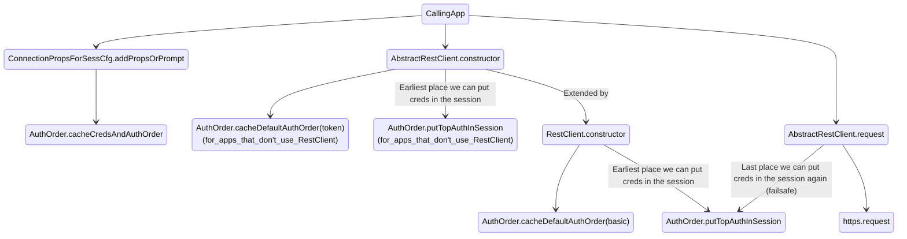
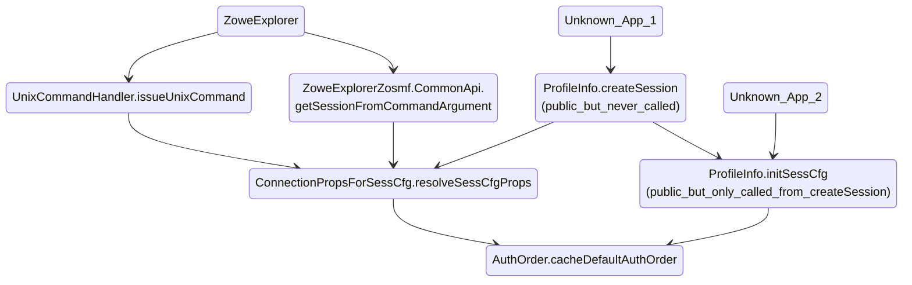

# Order of authentication in Zowe Clients

This document proposes a design to enable users to specify the order in which credentials are selected for authentication when multiple credentials are specified by the user.

Users might not intentionally specify multiple credentials for the same operation. However, because configuration properties can be inherited from a base profile or within nested profiles, it is possible that multiple credentials may be available when a Zowe client attempts to make a connection to a mainframe service.

## Use cases

A user may use the same user and password to authenticate to most of their services. It makes sense to place that user & password in a base profile so that they are automatically available to every service. This reduces redundancy and reduces maintenance efforts. If one service requires a token for authentication, the user might also store a token value within the base profile associated with API Mediation Layer (API-ML). Then, when connecting to that service through API-ML, both the user & password and a token will be available when Zowe CLI attempts to make a connection to that service. For this example, the token is the right choice for this service.  For historical reasons, Zowe always selects a user & password over a token when both are available. The use of user & password does not give the desired results.

In another example, sites gradually deploy API-ML and can easily encounter another (but opposite) authentication issue. Sites login to API-ML to obtain a token, which is then used to authenticate all future requests to services through API-ML. The API-ML token is typically stored in a base profile so that connections to all services are done through API-ML with its token. When a new service is brought on-line at a site, it is common for that service to not be immediately integrated with API-ML. For at least a period of time, the site makes a direct connection to that service. The site adds user/password properties to that service's profile to authenticate that direct connection. Once again, both user & password and a token are available when Zowe attempts to connect to the service for that profile. In this case, the user & password are the right choice for this service. However, this is the opposite choice from the previous example.

As these examples demonstrate, Zowe cannot simply change which authentication type should be given preference. It varies based on what a site is trying to do. That order might also change from one part of the customer's configuration to another. The preferred order in which credentials are chosen is further complicated when we consider that certificates may also be used by a site for some of its services.

## General approach for a solution

In this section we identify the key features that a solution would have to provide.

- The order in which different types of authentication are used should be controlled by the user in the Zowe client configuration.

- The user must be able to change that authentication order for different parts of the Zowe client configuration.

- Zowe client logic must be enhanced to select the authentication type for a profile based on a user-specified preferred order.

- Zowe client extenders (CLI plugins and ZE extensions) should **<u>not</u>** be able to alter the order of authentication types. The user should control that choice.

## Detailed requirements

- If a user does not specify the order of authentication, Zowe should use the historical order of authentication so that we do not introduce a breaking change.

- Zowe has an order of precedence for obtaining property values (config file, environment variable, command line). While a command line option will override the same property stored in a config file, it should not alter the order of authentication.

  - For example, assume that a user has specified that a certificate should be used before a token. Assume that a certificate is supplied in a config file and a token is supplied on the command line.

    - The certificate should be used because the user-configured authentication order specifies that certificates should be used before tokens.

    - The token should not be used just because it was supplied on the command line.

- Typically, Zowe client options can be specified in a configuration file, on the command line, or in an environment variable. Zowe CLI will **NOT** enable the authentication order to be specified in an environment variable.

  - A single environment variable property would be applied to **every** profile within the user's zowe.config.json file. The most likely customer use of an authentication order property will be to specify a different authentication order for different profiles. A single environment variable could defeat the primary purpose of enabling a user to specify a different authentication order for different profiles.

- The authentication order **could** be specified on the command line. However, in the initial implementation of this feature, Zowe CLI will **NOT** implement a command line option for the authentication order.

  - Conceptually, specifying an authentication order as a command line option is a reasonable idea. However, implementing that behavior could involve modifications to dozens of CLI command handlers, which could increase our implementation effort and time-to-market significantly.

  - It is not clear whether a command line option for authentication order will be particularly valuable to customers. The authentication order would typically be static for a given profile. It is unlikely to change from one CLI command to another.

  - Therefore, we will **NOT** implement a command-line option for authentication order until customer demand makes such work a priority.

- The authentication order only identifies the order in which Zowe chooses the **<u>one</u>** authentication method that will be used. If that first authentication method fails, Zowe will not make a second attempt to authenticate with any of the later authentication methods.

- Once an authentication is selected, our logic should ensure that only that one type of authentication is placed into a session object. Thus, logic in down-stream Zowe code will not alter the order of authentication selection, simply by testing for the authentications from the session in a different order than the order that the user specified.

  - If we were to continue to allow multiple authentications to be placed into a session, we will have to re-work various functions to test for authentications in the desired order. We will also have to provide the object containing that well-defined order to each such function. This will increase the amount of code being changed, and thus increase the time to market and increase the probability of mistakes.

- Zowe clients do not currently support AUTH_TYPE_CERT_PFX, so we cannot add it to a set of available authentications at this time. If AUTH_TYPE_CERT_PFX is implemented, it should be placed immediately after AUTH_TYPE_CERT_PEM in the default order.

- Customers should be able to specify AUTH_TYPE_NONE in their preferred order of authentications. While it is not advisable to have no authentication, if a customer has a service that requires no authentication, the customer should be able to specify AUTH_TYPE_NONE at the top of their list of authentications applicable to that particular profile.

- A customer should not have to specify every possible authentication in their ordered list of authentications. If a site only uses password and tokens, the customer should be able to specify only those two authentications in their list.

- If a customer-specified list of authentications contains none of our supported authentications, a default order will be used.

- The `--show-input-only` option should show the order of authentication as part of its displayed connection properties.

## Historical behavior

The objective of this feature is to enable users to define the order in which an authentication type is selected. However, when a user does not specify any such order, the default order should reflect past behavior.

- The AbstractRestClient currently enforces an order of:

  - AUTH_TYPE_TOKEN
  - AUTH_TYPE_BASIC
  - AUTH_TYPE_BEARER
  - AUTH_TYPE_CERT_PEM

- Zowe classes other than AbstractRestClient (like AbstractSession) currently override the authentication order from AbstractRestClient into:

  - AUTH_TYPE_BASIC
  - AUTH_TYPE_TOKEN
  - AUTH_TYPE_BEARER
  - AUTH_TYPE_CERT_PEM

These selections of authentication should be maintained as the default selections for their respective classes to avoid introducing a breaking change.

## Configuration enhancement

A new profile property named **authOrder** should be created to enable users to specify their order of precedence for  the authentication to be used when making a REST connection. The authOrder property should be treated like one of our key connection properties (like host and port). Thus authOrder would have the following characteristics:

- It must be specified within a "properties" object. That "properties" object could reside in:

  - A base profile

  - A parent profile of a nested configuration.

  - Any service profile.

  - Any profile specific to a plugin (or VSCode extension) that supports a REST connection. For example an **endevor** profile could contain an **authOrder** property, but an **endevor-location** profile would not.

- Our existing inheritance of connection properties should also apply to the inheritance of the authOrder property.

- We should be able to use our logic for where and how the **rejectUnauthorized** property is handled as a model for how we handle the **authOrder** property.

- A new property can be added to the **properties** of any profile. Since we are proposing that **authOrder** be handled by imperative functions, no CLI plugin or ZE extension will need modification for the **authOrder** property to be correctly handled.

- Such a new item within the properties object will not currently be included in the zowe.schema.json file. An IntelliSense-like editor will not display **authOrder** as an option when a user starts to add a new property in a profile.

  - We do not want to require plugins/extensions to add **authOrder** to their profiles. Asking extenders  to add AuthOrder to their set of options (and thus the schema) in the middle of a release's lifecycle can be a burden for those contributors.

  - As a result, we feel that losing IntelliSense is an acceptable compromise to avoid adding work to every extender. Users will lose a nice convenience, but the user's config will not be limited in any way at runtime.

## Characteristics of the authOrder property

To represent a series of values, the **authOrder** property will be a string containing well-defined keywords that are separated by commas. The left-most keyword in the string will be the top priority. Later authentication options will proceed to the right. The following example shows how a user could specify their desired authOrder.

```
"properties": {
    "host": ... ,
    "port": ... ,
    "rejectUnauthorized": ... ,
    "authOrder": "basic, token, cert-pem"
}
```

The set of accepted **authOrder** keywords are defined by the existing data type of SessConstants.AUTH_TYPE_CHOICES.

The current set of AUTH_TYPE_CHOICES are:

- AUTH_TYPE_BASIC = "basic"

- AUTH_TYPE_BEARER = "bearer"

- AUTH_TYPE_TOKEN = "token"

- AUTH_TYPE_CERT_PEM = "cert-pem"

- AUTH_TYPE_NONE = "none"

We should add a new AUTH_TYPE_CHOICE of:

- AUTH_TYPE_SSH_KEY = "ssh-key"

That addition of **ssh-key** would enable customers to also specify the authentication order of precedence for an SSH connection using an **authOrder** property. The only permissible values for an ssh connection would be "basic" and "ssh-key". Our ssh-handling logic will have to be modified to enforce that restriction and to honor the order. Conversely, our zosmf-handling logic would have to be modified to reject "ssh-key" in authOrder (or at least ignore it). If we choose not to implement authOrder for ssh at this time, we should at least create a design and implementation that can tolerate the addition of "ssh-key" at a later date.

While a user specifies the authentication order as a string of comma separated keywords, Zowe's internal representation for the authentication order will be an array of strings, each containing one keyword. The order of the array will represent the order in which the authentication will be chosen. The 0 index of the array will be the top priority. An internal array will make processing of the authentication order easier to implement and understand in the programming logic.

The internal programmatic definition of authOrder would be:

```
authOrder: SessConstants.AUTH_TYPE_CHOICES[]
```

## New auth login behavior

The `zowe auth login apiml` command previously created a new base profile named **YourCurrentBaseProfileName_apiml** whenever your current base profile contained a user and password. The reason for this is that the **login** command stored the newly acquired token into the base profile. Old hard-coded logic to select authentication credentials selected user and password over a token when all were available. Thus, the resulting configuration could not be used to login to API-ML with the token that the user just requested. As a work-around, the **login** command created a new base profile and appended **_apiml** to the name. It then placed the token into that new profile. The user and password remained in the old base profile.

While this kept the user/password and token separate, it required users to switch their base profile whenever the user wanted to use a profile that connected directly to a service versus using a profile that connected through API-ML. Alternatively the user could edit their configuration file to move user and password out of the existing base profile and then place a token into that existing base profile. All of these techniques were confusing, error-prone, and inconvenient.

Because the new authOrder property enables a user to select which credentials should be used, every type of credential can co-exist on the same base profile. As a result, the `zowe auth login apiml` command now places the resulting token into the current default base profile (or into the base profile specified on the command line).

The **login** command now also automatically places an **authOrder** property with a value of "token" into the default zosmf profile, so the token can be used immediately after logging into API-ML.

- Note that the **login** command will only add an **authOrder** property if the zosmf profile contains an **basePath** property (which indicates that the profile will be used to communicate with API-ML).

## Documentation Impact

- We must describe the purpose and function of the new authOrder property.

- We must describe where users can place the authOrder property.

- We must describe the default order of authentication, when no authOrder property is supplied.

- We must document that the new authOrder property name is a  Zowe reserved word that should **NOT** be used by any extender.

- We must notify extenders to guide their customers to supply an appropriate authOrder property if their extension needs a non-default order.

- We must update any documentation on the `zowe auth login apiml` command which contradicts the new behavior of that command.

## Edge cases that must be confirmed during implementation

Every edge case was not included in the protype used to confirm the validity of this design document. The following edge cases must be confirmed and appropriate logic must be written during the implementation of this design.

- As an alternative to user & password, a property named base64EncodedAuth can be used in a session. The new APIs must handle this alternative.

- To login to API-ML, a user supplies a user & password (or cert) and receives a token. The new APIs must determine the correct authentication type for such a session which kind of morphs its authentication type during the transaction.

- Zowe Explorer currently inherits the same hard-coded order as the CLI from the client SDKs. The new authentication order APIs must be integrated into the APIs used by Zowe Explorer. We must confirm whether any additional logic changes must be made within Zowe Explorer itself.

- TSO commands can create a sequence of actions, which use a user & password, receive a token from TSO, and then use that token for additional actions. This change in authentication type during the life of a single transaction may be self contained within the transaction and may not be influenced by either the existing hard-coded authentication order or the new user-controlled authentication order. This behavior must be confirmed and modifications made if necessary.

## A new class must be created to support authOrder

A new class located in:

    [zowe-cli/packages/imperative/src/rest/src/session/AuthOrder.ts](https://github.com/zowe/zowe-cli/blob/master/packages/imperative/src/rest/src/session/AuthOrder.ts)

should be implemented to detect the authentication order supplied by a user, and place the correct set of credentials into a session. The class currently exists as a workable proof of concept. With no confirmation of the many edge cases, it does appear to accomplished the basic needs. It can be finalized once it is fully integrated with existing Zowe logic.

This class is declared **@internal** which will limit its use to the imperative package. More access can be provided during implementation if we identify additional places in Zowe code that need to use functions from this class.

Functions in the AuthOrder class include:

- cacheCredsAndAuthOrder - This function will find all known types of credentials from the supplied command line arguments parameter. At this point in the processing of the request, those arguments will contain all of the already-merged properties from the actual command line, the profiles within the zowe.config.json file, and environment variables. All of the available credential properties are cached for later use by the putTopAuthInSession function. The cacheCredsAndAuthOrder function also calls the cacheAuthOrder function.

  cacheCredsAndAuthOrder will be called early in the operation, while putTopAuthInSession will be called as late as possible before the REST request is transmitted.

  The function ConnectionPropsForSessCfg.addPropsOrPrompt is the primary location that will call cacheCredsAndAuthOrder.

  - It might also be called from ProfileInfo.createSession.

  - While apps like ZE do not take command line arguments, they do form an ICommandArguments object. The createSesion function already has such an object, so it can be passed to cacheCredsAndAuthOrder.

  - Any other location in ZE-related code which needs to call cacheCredsAndAuthOrder will need to form an ICommandArguments object.

- cacheAuthOrder - This function stores the authOrder property from the supplied command arguments for later use. In the prototype, it is only called from cacheCredsAndAuthOrder. However, cacheAuthOrder is available should we find that we need to to call it from other locations (like at the end of the CommandProcessor.prepare function).

- cacheDefaultAuthOrder - This function will cache the default order of authentication selection that will be used only when a user does not supply an auth order. This function will specify the top authentication choice (either basic or token) when a default authOrder must be created because the user did not supply an auth order. The two choices for the top authentication exist so that our logic can maintain backward compatibility with two existing hard-coded sequences of authentication selections

  When authOrder has **NOT** been configured into zowe.config.json, the  default order will be one of the following:

  - If an argument of AUTH_TYPE_TOKEN is supplied, it will place token at the top of the order, resulting in this order:

    - AUTH_TYPE_TOKEN

    - AUTH_TYPE_BASIC

    - AUTH_TYPE_BEARER

    - AUTH_TYPE_CERT_PEM

    - AUTH_TYPE_NONE

  - If AUTH_TYPE_BASIC is supplied (or this function is not called), it will place basic at the top of the order, resulting in this order:

    - AUTH_TYPE_BASIC

    - AUTH_TYPE_TOKEN

    -  AUTH_TYPE_BEARER

    - AUTH_TYPE_CERT_PEM

    - AUTH_TYPE_NONE

  - It should be called from AbstractRestClient.constructor to replace its hard-coded array of credential types.

  - It might be called from other existing locations as needed.

- putTopAuthInSession - This function will find the credential available in the cache that is the highest priority credential as specified by the cached authOrder. It places that credential into the supplied session config, and removes the credentials for all other auth types from the supplied session config. It also places the cached authOrder into the session config.

  - The function AbstractRestClient.request is the primary location that will call cacheCredsAndAuthOrder.

  - It might be called from other existing locations as needed.

- removeExtraCredsFromSess - This function removes all credential properties from the supplied session except for the top available authentication type. In the prototype, it is only called from putTopAuthInSession. However, removeExtraCredsFromSess is available should we find that we must scrub unneeded credentials from a session in other location in existing Zowe code.

## Deployment of AuthOrder functions within the Zowe client APIs

The following diagram shows how the functions of the AuthOrder class will be deployed within the Zowe client API framework so that the authentication order is followed for a REST request with no new actions required by the calling Zowe application.



<br/><br/><br/>
To ensure that Zowe Explorer adheres to the authentication order, a call to AuthOrder.cacheDefaultAuthOrder will be added to ConnectionPropsForSessCfg.resolveSessCfgProps, which is already called by the ZE functions UnixCommandHandler.issueUnixCommand and ZoweExplorerZosmf.CommonApi.getSessionFromCommandArgument. Afterwards, Zowe Explorer's use of one of the **RestClient** classes will enforce AuthOrder for Zowe Explorer just as they do for Zowe CLI. Finally, we will add a call to AuthOrder.cacheDefaultAuthOrder to two public functions (ProfileInfo.createSession and ProfileInfo.initSessCfg) which are not currently called from either Zowe CLI or Zowe Explorer. This will ensure that any external app that calls those public functions will also adhere to the authentication order.



## Functions that reference AUTH_TYPE may need modification

The set of candidates for modification consist of all functions that contain the string ***"AUTH_TYPE_"***. This section contains an assessment of whether each such function affects the authentication order and must be modified.

- cli\src\config\auto-init\ApimlAutoInitHandler

  - doAutoInit - This function may logins into APIML with either user & password or cert. After login, the function needs to use the resulting APIML token to make an additional REST request of APIML to get its services. The doAutoInit function must be modified to switch the authOrder and the creds between those two calls.
    - **Modify doAutoInit ?  <span style="color:orange">yes - done</span>**

- core\src\rest\ZosmfRestClient.ts

  - processError - This function just alters error message text based on authentications found in the session. If only the top authentication type resides in a session, then no need to change the logic for testing AUTH_TYPEs.
    - **Modify processError ?  <span style="color:green">No</span>**

- imperative\src\config\src\ConfigAutoStore.ts

  - _fetchTokenForSessCfg - Since this function is used to explicitly retrieve a token value to be auto-stored into a session config, its use of AUTH_TYPE_TOKEN does not affect the auth order. So, no need to change.
    - **Modify _fetchTokenForSessCfg ? <span style="color:green">No</span>**

- imperative\src\imperative\src\config\cmd\import\import.handler.ts

  - buildSession - This function is used to import a config from a URL. That URL is an arbitrary location at a customer site where a config file is kept. It is not the target of a REST request to a mainframe service. By design, the only authentication that it will use is user & password. Supporting more authentication types in the 'import' command is beyond the scope of this authentication-order feature. None-the-less, because the **process** function of the import handler does not call ConnectionPropsForSessCfg.addPropsOrPrompt, the AuthOrder cache of credentials is not initialized. As a result, the buildSession function must call AuthOrder.cacheCredsAndAuthOrder to ensure that the cache is properly initialized.
    - **Modify buildSession ? <span style="color:orange">yes - done</span>**

- imperative\src\rest\src\client\AbstractRestClient.ts

  This class is the only class to use the recently created ISession.authTypeOrder property, which is an array of authentication types supplied in the order in which they should be selected.

  - buildOptions - This function currently tests for the authentication based their the order in the ISession.authTypeOrder property of the session config. This must be modified to instead get the authentication order from AuthOrder.getAuthOrder.

    - **Modify buildOptions ? <span style="color:orange">yes - done</span>**

  - constructor - This function currently hard-codes an order of authentication types into the ISession.authTypeOrder array contained in the supplied session. It must be modified to instead call AuthOrder.cacheDefaultAuthOrder with a topDefaultAuth of token.

    - **Modify constructor?   <span style="color:orange">yes - done</span>**

  - request - Before calling the https.request() function, the AbstractRestClient.request function must call AuthOrder.putTopAuthInSession to scrub the session configuration before making the actual REST request.

    - **Modify request? <span style="color:orange">yes - done</span>**

  - Each of the following functions reference AUTH_TYPE_XXX to place an identified type into the ISession.type property of the session. Since buildOptions calls just one of the following functions based on being the first available authentication provided by AuthOrder.getAuthOrder, none of the following functions need to change.

    - **Modify setBearerAuth ? <span style="color:green">No</span>**

    - **Modify setCertPemAuth ? <span style="color:green">No</span>**

    - **Modify setPasswordAuth ? <span style="color:green">No</span>**

    - **Modify setTokenAuth ? <span style="color:green">No</span>**

- imperative\src\rest\src\session\AbstractSession.ts

  - buildSession - This private function is called by the constructor, which accepts an Isession object. The caller of the Session.constructor will have already called ConnectionPropsForSessCfg.addPropsOrPrompt() which will have already cached the available credentials and cached the authOrder. We should confirm that this always true.

    - **Modify buildSession ? <span style="color:green">No</span>**

  - DEFAULT_TYPE - This is simply a constant definition set to AUTH_TYPE_NONE. It is not used in any CLI or ZE code outside of this AbstractSession class. Because it is a public property, it cannot be removed without risk of breaking change.

    - **Modify DEFAULT_TYPE ? <span style="color:green">No</span>**

- imperative\src\rest\src\session\ConnectionPropsForSessCfg.ts

  - addPropsOrPrompt - Near the end of this function, a call to AuthOrder.cacheCredsAndAuthOrder will ensure that the right authentication resides in the session.

    - **Modify addPropsOrPrompt ? <span style="color:orange">Yes - done</span>**

  - resolveSessCfgProps - When connection options specify that the session is intended to make a request for a token, then this function must record that intention within the authentication cache stored in the sesion.

    - **Modify resolveSessCfgProps ? <span style="color:orange">Yes - done</span>**

  - setTypeForTokenRequest - This function handles setting authentication to AUTH_TYPE_TOKEN to get a token back from user & password. This should not require any change.

    - **Modify setTypeForTokenRequest ? <span style="color:green">No</span>**

- imperative\src\rest\src\client\RestClient.ts

  This class extends the AbstractRestClient, which as stated above, sets token as the top default authentication type. However our historical behavior is that RestClient and all classes extended from RestClient want the top default authentication to be basic.

  - constructor - RestClient did not previously have a constructor. A new constructor must be added to call the super class constructor (from AbstractRestRestClient) and then call AuthOrder.cacheDefaultAuthOrder(basic) to change the inherited top authentication order. It seems a little weird, but this just reflects past behavior and avoids a breaking change.

    - **Add constructor? <span style="color:orange">Yes - done</span>**

- imperative\src\rest\src\session\SessConstants.ts

  - Constants and type definitions of AUTH_TYPE_XXX are what they need to be.
    - **Modify constants ? <span style="color:green">No</span>**

- imperative\src\rest\src\session\Session.ts

  - createFromUrl - This function is only called from ImportHandler.buildSession to enable importing a config from a URL. As with ImportHandler.buildSession, the use of AUTH_TYPE_BASIC when user & password exist is appropriate and should not need to change.
    - **Modify createFromUrl ? <span style="color:green">No</span>**

- imperative\src\rest\src\session\doc\IOptionsForAddConnProps.ts

  - supportedAuthTypes - Our set of supported authentications will not change as part of this feature.
    - **Modify supportedAuthTypes ? <span style="color:green">No</span>**

- imperative\src\rest\src\session\doc\ISession.ts

  - authTypeOrder - This property is used to hold the order of authentication types. It is currently populated by hard-coded login and is only used in AbstractRestClient.constructor & AbstractRestClient.buildOptions. There is no reason to change this property. However, a new property must be added to cache the complete set of available credentials within the session object .

    - **Modify authTypeOrder ? <span style="color:orange">Yes - done</span>**

- packages\zosuss\src\SshBaseHandler.ts

  - process - This function explicitly sets a property named **supportedAuthTypes** to AUTH_TYPE_BASIC. It is unclear why there is no option in this logic to use an ssh-key. While enabling SSH to also adhere to a customer-specified authentication order might be beneficial, it will not be done at this time to limit the scope of these efforts.
    - **Modify process ? <span style="color:green">No</span>**

  packages\zosuss\src\Shell.ts

  - connect - This function explicitly checks for an ssh key (first) or a password (second) in a hard-coded fashion. If we want the user's authOrder to apply to ssh connections, this function must call the proposed combination of AuthOrder.cacheCredsAndAuthOrder and AuthOrder.putTopAuthInSession to to make the right authentication choice. This will not be done at this time to limit the scope of these efforts.
    - **Modify connect ? <span style="color:green">No</span>**

## Functions that reference rejectUnauthorized may need modification

If we treat **authOrder** like other connection properties, those functions that process **rejectUnauthorized** may also need to process **authOrder**. This section contains an assessment of whether each such function must be modified.

- packages\cli\src\config\auto-init\ApimlAutoInitHandler.ts

  - doAutoInit - This function was analyzed in the previous section of this document.
    - **Modify doAutoInit ? <span style="color:orange">yes - done</span>**

- packages\cli\src\imperative.ts

  - This class provides definitions used to create the Zowe command tree and other CLI operating properties. It includes command-line options for connection properties (like host, port, user, and password). We could add **authOrder** as a new command line option into this class. Because this could place a requirement on plugins to re-program their apps to accept a global option for `--auth-order`. To avoid breaking changes we will not make this change. We will accept the fact that auth-order is not part of the schema and will not be included in VSCode IntelliSense.
    - **Modify imperative.ts? <span style="color:green">No</span>**

- packages\core\src\constants\Core.constants.ts

  - BaseProfile - This object contains a schema definition for a base profile. An authOrder property must be added to this object. To limit the scope of the current efforts, we will not make this change. We will accept the fact that auth-order is not part of the schema and will not be included in VSCode IntelliSense.
    - **Modify BaseProfile ? <span style="color:green">No</span>**

- packages\imperative\src\config\src\ProfileInfo.ts

  - createSession - This function creates a session with key connection properties. Depending on the modification choices made for ConnectionPropsForSessCfg.resolveSessCfgProps, this function may have to call AuthOrder.cacheCredsAndAuthOrder.
    - **Modify createSession ? <span style="color:orange">Yes - must be implemented</span>**

- packages\imperative\src\imperative\src\config\cmd\import\import.handler.ts

  - buildSession - This function was analyzed in the previous section of this document.
    - **Modify buildSession ? <span style="color:orange">Yes - done</span>**

- packages\imperative\src\rest\src\client\AbstractRestClient.ts

  - buildOptions - This function was analyzed in the previous section of this document.
    - **Modify buildOptions ? <span style="color:orange">Yes - done</span>**

- packages\imperative\src\rest\src\client\ProxySettings.ts

  - getProxyAgent - This function requires an ISession object. The ISession.authTypeOrder should have already been populated. Therefore, no change should be required in getProxyAgent
    - **Modify getProxyAgent ? <span style="color:green">No</span>**

- packages\imperative\src\rest\src\client\doc\IHTTPSOptions.ts

  - IHTTPSOptions - This interface is only used by AbstractRestClient. Credentials are never extracted from nor added to this an instance of this interface. Therefore there is no reason to add authOrder to this interface.
    - **Modify IHTTPSOptions ? <span style="color:green">No</span>**

- packages\imperative\src\rest\src\session\AbstractSession.ts

  - buildSession - This function was analyzed in the previous section of this document.
    - **Modify buildSession ? <span style="color:green">No</span>**

- packages\imperative\src\rest\src\session\doc\ISession.ts

  - authTypeOrder - This property was analyzed in the previous section of this document.
    - **Modify authTypeOrder ? <span style="color:orange">Yes - done</span>**

- packages\zosjobs\src\GetJobs.ts

  - getJob - This function displays rejectUnauthorized in a diagnostic message. No need to process authOrder here.
    - **Modify getJob ? <span style="color:green">No</span>**

- packages\zosmf\src\ZosmfSession.ts

  - This Class contains option definitions for connection properties that can be defined in profiles. A definition of the authOrder connection property with a name like ZOSMF_OPTION_AUTH_ORDER should be added.

    We could add **authOrder** as a new property. However, to limit the scope of this work, we will not make this change. We will accept the fact that auth-order is not part of the schema and will not be included in VSCode IntelliSense.

    - **Modify ZosmfSession.ts ? <span style="color:green">No</span>**

- packages\zosmf\src\constants\Zosmf.messages.ts

  - This class provides message text used to display error details. There is no clear reason to add authOrder to this class.
    - **Modify Zosmf.messages.ts ? <span style="color:green">No</span>**

- packages\zosmf\src\constants\Zosmf.profile.ts

  - ZosmfProfile - This class provides the property definitions for a zosmf profile type. We could add **authOrder** as a new property. This could place a requirement on plugins to re-program their apps to accept an **authOrder** property. To avoid breaking changes we will not make this change. We will accept the fact that **authOrder** is not part of the schema and will not be included in VSCode IntelliSense.

    - **Modify Zosmf.profile.ts ? <span style="color:green">No</span>**

##