# How Zowe CLI team configuration files are merged together

Zowe CLI commands require connection properties and application-specific properties to perform desired operations against various mainframe services. Zowe CLI team configuration profiles are a means to store such properties on disk so that a user does not have to specify every required property on every zowe command. This document describes the behavior of merging configuration profiles when using Zowe CLI team configuration files.

## General rules for merging profiles from team configuration files

Global configuration files reside in the ZOWE_CLI_HOME directory (which is YourUserHomeDirectory/.zowe by default). Project configuration files are placed in a directory of your choice. Such a project config file is only applied when you run a CLI command in that project directory or one of its subdirectories.

When a team configuration and a user configuration are placed at the same level (both files are in the ZOWE_CLI_HOME directory or both are in the same project directory), the merging of profile properties are done property-by-property. A profile property value in the user config will override a value in the team config file. If a profile property value exists in one config file but not the other, then that value will be also included in the merged set of properties used by a CLI command.

When configuration files (either team or user) exist at both the global level and in a project directory, a profile from a project config completely replaces a profile of the same name from the global config. All profiles that exist in one config file but **NOT** in the other config file are included in the resulting configuration that is used by a CLI command.

Potentially, four configuration file can be in used at once:

- A global team configuration file
- A global user configuration file
- A project directory team configuration file
- A project directory user configuration file

Any combination from one to all four of these configuration files can be used together. When any file is not present, the same rules for merging files in the same directory versus merging a global configuration into a project configuration still apply. When configuration files are merged, none of the configuration files themselves are changed. A logical merged result is simply used by the desired Zowe CLI command.

The following diagram shows the order in which the four configuration files will be merged and describes how the profile properties of these configuration files will be merged together to form the configuration used by Zowe CLI commands.

```mermaid
flowchart TB
    globTeam[Global team config = $ZOWE_CLI_HOME/zowe.config.json]
      -- 1 - Merge the global team config with the global user config
      --> globUser[Global user config = $ZOWE_CLI_HOME/zowe.config.user.json \n\n * When an identically named property exists within an identically \n named profile in both the global team config and this global \n user config, the property value from this global user config \n will be used in the resulting configuration. \n\n * When an identically named profile exists in both the global team \n config and this global user config, but a property of   that profile \n only exists in one of the two configurations, that property will \n also be included in the resulting configuration. \n\n * If a profile exists in only one of these two config files, that profile \n will be included, in its entirety, in the resulting  configuration]

    globUser
      -- 2 - Merge the results of the previous merge with project team config
      --> projTeam[Project team config = some/project/directory/zowe.config.user.json \n\n * When an identically named profile exists in both the results of the \n previous merge and in this project team config file, that profile \n will be completely replaced by the profile from this project \n team config. \n\n * If a profile only exists in the results of the previous merge or in \n this project team config file, but not both, that profile will \n also be included, in its entirety, in the resulting configuration]

    projTeam
      -- 3 - Merge the results of the previous merge with project user config
      --> projUser[Project user config = some/project/directory/zowe.config.user.json \n\n * When an identically named property exists within an identically \n named profile in both the results of the previous merge and this \n project user config, the property value from this project user \n config will be used in the resulting configuration. \n\n * When an identically named profile exists in both the result of the \n previous merge and this project user config, but a property of \n that profile only exists in one of the two configurations, that \n property will also be included in the resulting configuration. \n\n * If a profile exists in the results of the previous merge or in this project \n user config file, but not both, that profile will be included, in its \n entirety, in the resulting configuration]
```




## Best Practices

If you choose to use only global configuration files or project-level configuration files it will be easier to remember and find the set of profile properties that will be used by CLI commands. Combining both a global and project configuration works in a consistent fashion, but you must remember that your current directory dictates when one or both configurations apply, and you must remember the different rules that are used when merging between global and project configurations.

### **Advantages of only using a global configuration**

You might choose to use a global configuration file if you typically use the same set of hosts and services for all of your mainframe activities. You will only maintain one Zowe CLI configuration that will be used for CLI commands regardless of the directory in which you are located when you run a zowe command. You can edit your global configuration file in a text editor to make quick temporary changes. For example, you might briefly change the port number of a service to try out a test instance of a given service. Similarly, you could quickly change the default profile for a given profile type with a quick change in your text editor. By doing that, you could perform the same operation against different mainframe hosts with the exact same zowe command, rather than having to specify a different profile name option on each command.

The config file's ability to understand comments (// or /* */) can make such quick edits even easier. You can comment-out several alternatives and then just uncomment the one you want to use, rather than having to remember the correct value and retyping that alternative.

Since a global configuration exists under your HOME directory, it belongs to you personally. Thus, you may not have a great need for a user configuration file in this scenario - all of the values in a global configuration already belong to you. If you want to periodically share your configuration with colleagues, you could choose to place your standard configuration in a normal team configuration file (zowe.config.json) and place your specialty alternatives in your user configuration (zowe.config.user.json). If you receive an ad-hoc request from a colleague for your configuration, you could just send your zowe.config.json file to that person. Thus you could avoid scrubbing your configuration file before sending it to someone else.

### **Advantages of only using a project configuration**

A project configuration is simply a team configuration file that resides in an arbitrary directory of your choice. Typically, that directory would contain application source code files for one of your projects. That is why we refer to it as a project configuration.

Typically, your application source files are maintained in some source control tool. A zowe configuration file located in that same directory could also be placed into source control. If so, each member of your team who retrieves the application source, will also automatically retrieve the Zowe configuration file from source control. In this scheme every member of your team can easily share the same configuration when working on that particular application project.

If you work on multiple projects, by simply changing your directory into the desired project directory, your Zowe CLI configuration will automatically change to the configuration that is appropriate for that project.

Whether you share a global Zowe configuration with teammates in an ad-hoc fashion, or share a project Zowe configuration with teammates through a source control tool; others on your team can easily share the same working Zowe configuration. That is why we generically refer to our Zowe CLI V2 configuration as a `team configuration`.

It is when you are using a Zowe CLI configuration in a project directory that you are most likely to use a user configuration. A user configuration has the same structure as a team configuration (although you typically would only specify a small subset of properties that are specific to your needs.) For example, perhaps you need to debug a special test instance of some service, while the rest of your team might need to use a production instance of that same service. You could place the port number of your special test instance into your user config file. Everyone shares all of the other properties from the project team configuration, but only your user config file will override the port number to point to your test instance. With such a scheme, every user could connect to their own test instance of a service, by each user specifying a unique port number in their own user config file.

While you commit your project team configuration file into your source control tool, you **NEVER** commit your user config file into source control. This is what enables the team to share most properties, but still have a few personal overrides when needed.

### **Considerations when using both global and project configurations**

As displayed in the diagram earlier in this document, you can potentially have four Zowe config files in effect at one time (global-team, global-user, project-team, and project-user). Each config file can override some or all properties of other config files. You can encounter unexpected results if you forget which config files you have deployed in which locations.

If you are working in a project directory, you will have a configuration composed of up to all four configuration files. If you change up one directory out of your project directory, your configuration will only be composed of your global configuration files. You may start to communicate to different hosts, on different ports, using different credentials. If you then changes into another project directory, all of those things could change again. You must be aware of this dynamic to properly understand what is happening.

If become confused by connection problems in a such a multiple configuration environment, a few Zowe commands can help identify from where your current property values are obtained.

Placing the `--show-inputs-only` option on a command will display the final merged property values that will be used by the Zowe command to which you add the  `--show-inputs-only` option. You will **NOT** actually run the command. The output will help you identify if the command will not work because you are using an unintended configuration property.

```
zowe zos-files list data-set "SYS1.PARMLIB*" --show-inputs-only
commandValues:
  host:                YourHostname.YourCompany.com
  port:                1234
  user:                YourUserName
  password:            YourPassword
  reject-unauthorized: false
  protocol:            https
  show-inputs-only:    true
profileVersion:   v2
optionalProfiles:
  - zosmf
  - base
locations:
  - T:\proj_config\zowe.config.user.json
  - T:\proj_config\zowe.config.json
  - C:\Users\YourUserName\.zowe\zowe.config.user.json
  - C:\Users\YourUserName\.zowe\zowe.config.json
```

The following command will list the set of configuration files that are in effect for the directory in which you run this command. After running the command, you see how many (and which) files you must inspect to find a property value that you are inadvertently using.

```
zowe config list --locations --root
T:\proj_config\zowe.config.user.json
T:\proj_config\zowe.config.json
C:\Users\YourUserName\.zowe\zowe.config.user.json
C:\Users\YourUserName\.zowe\zowe.config.json
```

The following command shows every value obtained from every configuration file. With this command you do **NOT** see the resulting values after the configurations are merged. Instead, you see each value from each configuration file. While it requires a detailed inspection of the output, you can find the incorrect property value and know from which configuration file that value came.
```
zowe config list --locations
T:\proj_config\zowe.config.user.json:
  $schema:   ./zowe.schema.json
  profiles:
    YourZosmfProfileName:
      type:       zosmf
      properties:
        host: YourHostname.YourCompany.com
        port: 1234
        user: YourUserName

    ... Many more properties are displayed ...

```

## Details of specific scenarios

The following sections describe the detailed behavior that occurs under specific deployments of configuration files.

### **Using a global team config and a global user config**
    zowe config init --global-config
    zowe config init --global-config --user-config

In this scenario, you only have config files at the global level.

This creates a set of set of empty profiles and empty secure arrays in the user config. In this configuration, the empty properties objects and empty secure arrays in the zosmf and base profiles in the user config are ignored. You do not have to update the user config file for the team config file to successfully run zowe commands.

After you place property values into the same profile in both the team global config and global user config, the user config overrides property values from the team config. This is done on a property-by-property basis. In other words, the user config profile does not override the **ENTIRE** profile from the team config.

### **Using a project-level team config and a project-level user config**

    zowe config init
    zowe config init --user-config

In this scenario, you only have config files at the project level.

This creates a set of set of empty profiles and empty secure arrays in the user config. In this configuration, the empty properties objects and empty secure arrays in the zosmf and base profiles in the user config are ignored. You do not have to update the user config file for the team config file to successfully run zowe commands.

After you place property values into the same profile in both the project team config and project user config, the user config overrides property values from the team config. This is done on a property-by-property basis. In other words, the user config profile does **NOT** override the **ENTIRE** profile from the team config.

This is the same behavior as when both a team config and user config exist at the global level.

### **Using a global team config and a project-level team config**

    zowe config init --global-config
    zowe config init

In this scenario, you have no user config files. You only have a global team config and a project team config file.

After you place property values into profiles in both the global team config and project team config, overrides are done on a per-profile basis (not a per property basis). The profiles in the project team config will completely replace profiles of the same name from the global team config. A profile that exists in one config file but **NOT** in the other config file is recognized and used successfully.

### **Using a global team config and a project-level user config**

    zowe config init --global-config
    zowe config init --user-config

In this scenario, you only have a team config at the global level and only have a user config at the project level.

In this merge, overrides are done on a per-profile basis (not a per-property basis).

The `zowe config init --user-config` command creates a set of empty profiles in the user config. The empty profiles in the user config will completely replace profiles of the same name from a global config. For example, if you want to override the zosmf port, you must create a zosmf profile in the project user config, **AND** delete the empty base config in the project user config so that it does not override the global base profile (which contains host and rejectUnauthorized) with an empty base profile.

After you place property values into profiles in both the global team config and project user config, overrides continue to be done on a per-profile basis. The profiles in the project user config will completely replace profiles of the same name from the global team config. A profile that exists in one config file but **NOT** in the other config file is recognized and used successfully.

This merging behavior is the same as when team config files exist at both the global and project level.

### **Using a global user config and a project-level team config**

    zowe config init
    zowe config init --user-config --global-config

In this scenario, your global user config contains profiles with **NO** properties. The profiles in the project-level team config contain values for which you were prompted during the `zowe config init` command. The project team config profiles completely replace profiles of the same name from the global user config. As a result, the behavior will be as if you did not even have a global user config file.

After you place property values into profiles in both the global user config and project team config, overrides continue to be done on a per-profile basis. The profiles in the project team config will completely replace profiles of the same name from the global user config. A profile that exists in one config file but **NOT** in the other config file is recognized and used successfully.

### **Using a global user config and a project-level user config**

    zowe config init --user-config --global-config
    zowe config init --user-config

In this scenario, you have no team config files. You only have a global user config and a project user config file.

After the commands above, neither user config file has property values initially populated. Once profile property values are added, overrides continue to be done on a per-profile basis (not a per property basis). The profiles in the project user config will completely replace profiles of the same name from the global user config. A profile that exists in one config file but **NOT** in the other config file is recognized and used successfully.

This merging behavior is the same as when team config files exist at both the global and project level.

### **Using all 4 config files at the same time**

In this scenario, you have a global team config, a global user config, a project team config, and a project user config.

1. The global user config overrides the global team config on a per-property basis.
2. The project team config overrides the results of step 1 on a per-profile basis.
3. The project user config overrides the results of step 2 on a per-property  basis.

## Differences in merging when using Zowe Explorer

***To be supplied***
